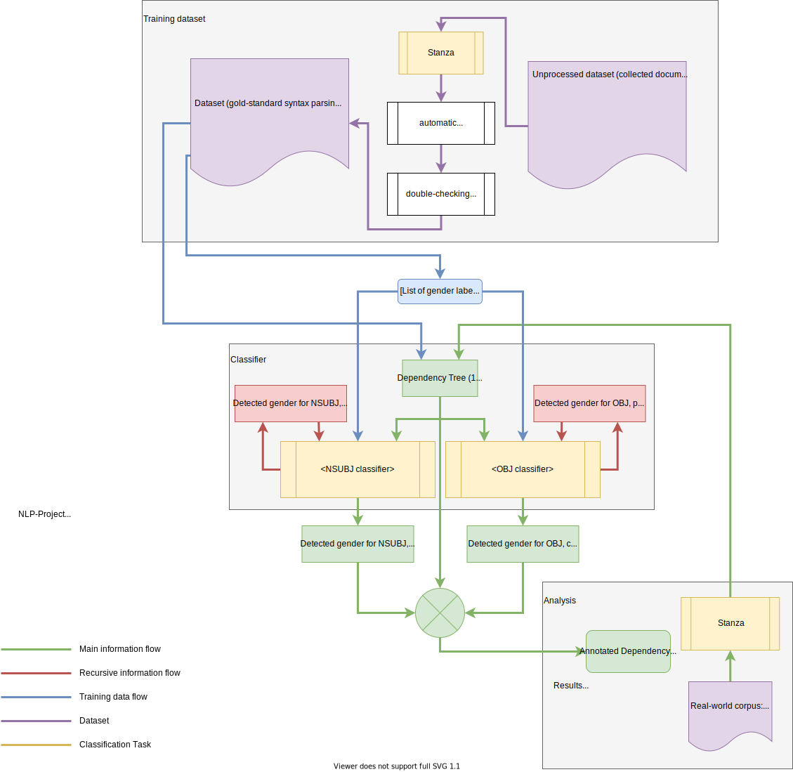
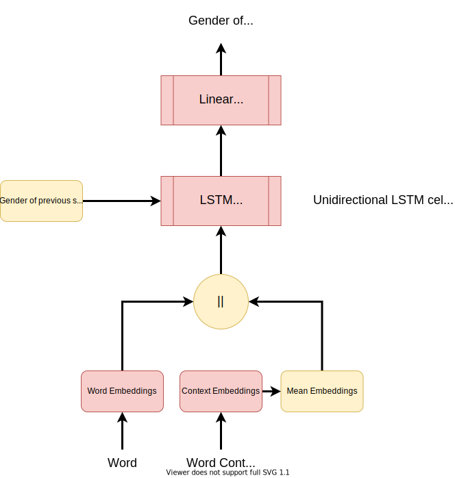

# The IAS-team's NLP Project

> This repository houses the NLP project by Anastasiia Menshikova and Hendrik Erz on gender-bias detection for the NLP-course TDDE09.

The aim of this project is to use a state-of-the-art tagger/parser-pipeline for two tasks: first, to generate a gold-standard dataset and, second, to train a classifier on that data in order to predict the gender of nouns and proper nouns in unseen data. With the resulting data, so our hope, it will be possible to analyse a variety of questions, for example whether or not there is a significant gender-bias, visible in female nouns/proper nouns being more often in the object position of sentences.

## Setup

> This repository requires an environment with Python 3.8, as PyTorch and Stanza do not necessarily work with Python 3.9.

```bash
$ git clone https://github.com/nathanlesage/so-classifier.git
$ cd so-classifier
$ python -m pip install -r requirements.txt
$ python main.py
```

> If you are executing the code for the first time, make sure to run `$ python main.py stanza --download` in order to download the required English dataset for Stanza. Additionally, if you'd like to train the classifier using pre-trained GloVe embeddings, which might increase accuracy and speeds up training, make sure to run `$ python main.py glove --download` in order to download the GloVe word embeddings prior to training the classifier.

## How to Use: Command-Line Interface

This project works by calling `main.py` and providing the appropriate command-line commands. The classifier offers four modules with a certain set of sub-commands. Make sure to have installed the dependencies correctly in order for the script to work properly.

A correct call looks like this, where `argument` is one of the flags specified below:

```
$ python main.py {stanza|glove|data|model} {argument}
```

Here is a list of all available commands:

```
stanza
    --download | -d             # Downloads the necessary data for Stanza to run
glove
    --download | -d             # Downloads the GloVe embeddings (300 dimensions)
data
    --define-labels | -d        # Define the labels for the annotation
    --preprocess | -p           # Parse raw text data into dependency trees
    --annotate | -a             # Annotate preprocessed data with labels
    --split | -s                # Create a train/test split from the annotated data
model
    --train | -t                # Trains a model with 10 epochs (default) or user-defined
    --export-embeddings | -e    # Exports the embeddings learned by the model ready for the TensorFlow projector
    --console | -c              # Spins up an interactive console to tinker with a trained model
```

## Background

First, have a look at the overall diagram for the full pipeline we chose to implement. You can identify three core areas of concern:

1. The building of the gold-standard dataset in the top
2. The set up of the actual classification pipeline in the center
3. The analysis of the results on the bottom.



### Curating a Gold-Standard Dataset

The literature on corpus annotation highlights a range of essential decisions to be made at every step (Ide & Pustejovsky, 2017; Pustejovsky & Stubbs, 2012). First, we shall compile a corpus of documents for annotation that suits our purposes, and therefore need to adhere to the representativity principle and avoid potential biases at the stage of data collection. Second, we need to preprocess and manage the data in order to make it (1) convenient for the annotators and (2) convertible into the form of input required by the classifier later. This stage might involve data cleaning and additional feature generation substeps. Next, we should develop clear instructions for the annotators and provide training (Geva et al., 2019; Sabou et al., 2014). Alongside, we shall think of an appropriate software/tool for the annotation process (Neves & Ševa, 2021). When the annotation is finally performed, we shall study the agreement between annotators (Artstein & Poesio, 2008). If the inspection of the annotation quality reveals serious mismatches between the coders, the process should be revised at each step.

### Dataset to Train On

We have considered multiple sources of textual data, looking for the most suitable dataset for our project. Popular choices to study gender biases in text corpora are fiction books, news reports, movie screenplays, advertising texts or social media posts. For our purposes, we would need a dataset with texts dominated by mentions and descriptions of man and women, as the sentences with no entities which can be assigned with a gender label are irrelevant for the classifier training. A helpful feature of the texts we need would be a consistent and complete description of women’s or men’s actions or life course; because in this way we can ensure to our classifier can learn to assign gender labels propagated through neighbouring sentences via the means of anaphoras and cataphoras. Therefore, we decided to opt for the dataset with Wikipedia biographies (Lebret et al., 2016)

In fact, in this project we are reproducing by making a classifier that predicts gender labels based on the syntactic features of the sentences, we simply make it to reproduce the biases which were already present in the textual data we are feeding into it. The biases in Wikipedia texts have binary nature. First, we might see women more often in a position of sentence objects because the texts are picturing the reality, and the reality has been for a long time skewed to white males being in a position of a subject, literally and in a syntactical sense. Second, the creators and editors of the Wikipedia pages are likely to write life stories of man and women differently, perhaps unconsciously, but through the lens of internalised social norms claiming that a man is supposed to be an actor, and a woman is expected to be the one to whom the actions are applied.

Wikipedia Biographies dataset consists of 728,321 biographies, and besides the textual descriptions we have plenty of metadata. This is definitely an advantage in our case, because we can as a minimum avoid representativity bias via creating a balanced subset of biographies with an equal amount of training data for men and women, and as a maximum to control for other variables like year of birth, country of birth, occupation field etc.

Link to a repository with data to be sampled and annotated later:
https://github.com/DavidGrangier/wikipedia-biography-dataset

### Tagger/Parser Pipeline

We will, as our tagger/parser combination, make use of Stanford’s Stanza parser (Stanford NLP Group, 2017/2021), which performs well on English corpora.

### Classifiers

For the classifiers, we will be implementing a modulation of the Levy/Goldberg sentiment analysis parser (2014) introduced by Komninos/Manandhar (2016), which is fit for making use of dependency trees in order to enhance sentiment analysis. We will be using their LSTM-based implementation because – albeit it did not always perform best – with this approach we have the ability to bias the initial hidden state towards the previous sentence’s predicted gender.

Below you can find a diagram of the pipeline we employ in both classifiers. The previous gender can either be the previous sentence's subject or object, depending on the classifier type. The classifiers themselves are agnostic to the subject or object. Our hope is that each classifier becomes aware of which words it should pay attention to -- either those with object-related dependency relations or those with subject-related dependency relations.



## References

- Artstein, R., & Poesio, M. (2008). Inter-Coder Agreement for Computational Linguistics. Computational Linguistics, 34(4), 555–596. https://doi.org/10.1162/coli.07-034-R2
- Garg, N., Schiebinger, L., Jurafsky, D., & Zou, J. (2018). Word embeddings quantify 100 years of gender and ethnic stereotypes. Proceedings of the National Academy of Sciences, 115(16), E3635–E3644. https://doi.org/10.1073/pnas.1720347115
- Geva, M., Goldberg, Y., & Berant, J. (2019). Are We Modeling the Task or the Annotator? An Investigation of Annotator Bias in Natural Language Understanding Datasets. ArXiv:1908.07898 [Cs]. http://arxiv.org/abs/1908.07898
- Ide, N., & Pustejovsky, J. (Eds.). (2017). Handbook of Linguistic Annotation. Springer Netherlands. https://doi.org/10.1007/978-94-024-0881-2
- Karimi, F., Wagner, C., Lemmerich, F., Jadidi, M., & Strohmaier, M. (2016). Inferring Gender from Names on the Web: A Comparative Evaluation of Gender Detection Methods. Proceedings of the 25th International Conference Companion on World Wide Web, 53–54. https://doi.org/10.1145/2872518.2889385
- Komninos, A., & Manandhar, S. (2016). Dependency Based Embeddings for Sentence Classification Tasks. Proceedings of the 2016 Conference of the North American Chapter of the Association for Computational Linguistics: Human Language Technologies, 1490–1500. https://doi.org/10.18653/v1/N16-1175
- Kozlowski, A. C., Taddy, M., & Evans, J. A. (2019). The Geometry of Culture: Analyzing the Meanings of Class through Word Embeddings. American Sociological Review, 84(5), 905–949. https://doi.org/10.1177/0003122419877135
- Lebret, R., Grangier, D., & Auli, M. (2016). Neural Text Generation from Structured Data with Application to the Biography Domain. ArXiv:1603.07771 [Cs]. http://arxiv.org/abs/1603.07771
- Levy, O., & Goldberg, Y. (2014). Dependency-Based Word Embeddings. Proceedings of the 52nd Annual Meeting of the Association for Computational Linguistics (Volume 2: Short Papers), 302–308. https://doi.org/10.3115/v1/P14-2050
- Lu, K., Mardziel, P., Wu, F., Amancharla, P., & Datta, A. (2020). Gender Bias in Neural Natural Language Processing. In V. Nigam, T. Ban Kirigin, C. Talcott, J. Guttman, S. Kuznetsov, B. Thau Loo, & M. Okada (Eds.), Logic, Language, and Security: Essays Dedicated to Andre Scedrov on the Occasion of His 65th Birthday (pp. 189–202). Springer International Publishing. https://doi.org/10.1007/978-3-030-62077-6_14
- Neves, M., & Ševa, J. (2021). An extensive review of tools for manual annotation of documents. Briefings in Bioinformatics, 22(1), 146–163. https://doi.org/10.1093/bib/bbz130
- Park, S., & Woo, J. (2019). Gender Classification Using Sentiment Analysis and Deep Learning in a Health Web Forum. Applied Sciences, 9(6), 1249. https://doi.org/10.3390/app9061249
- Pustejovsky, J., & Stubbs. (2012). Natural Language Annotation for Machine Learning [Book]. https://www.oreilly.com/library/view/natural-language-annotation/9781449332693/
- Sabou, M., Bontcheva, K., Derczynski, L., & Scharl, A. (2014). Corpus Annotation through Crowdsourcing: Towards Best Practice Guidelines. Proceedings of the 9th International Conference on Language Resources and Evaluation (LREC’14).
- Shor, E., van de Rijt, A., & Fotouhi, B. (2019). A Large-Scale Test of Gender Bias in the Media. Sociological Science, 6, 526–550. https://doi.org/10.15195/v6.a20
- Stanford NLP Group. (2021). Stanza: A Python NLP Library for Many Human Languages (v1.2.0) [Python]. Stanford University. https://github.com/stanfordnlp/stanza (Original work published 2017)
- Sun, T., Gaut, A., Tang, S., Huang, Y., ElSherief, M., Zhao, J., Mirza, D., Belding, E., Chang, K.-W., & Wang, W. Y. (2019). Mitigating Gender Bias in Natural Language Processing: Literature Review. ArXiv:1906.08976 [Cs]. http://arxiv.org/abs/1906.08976
